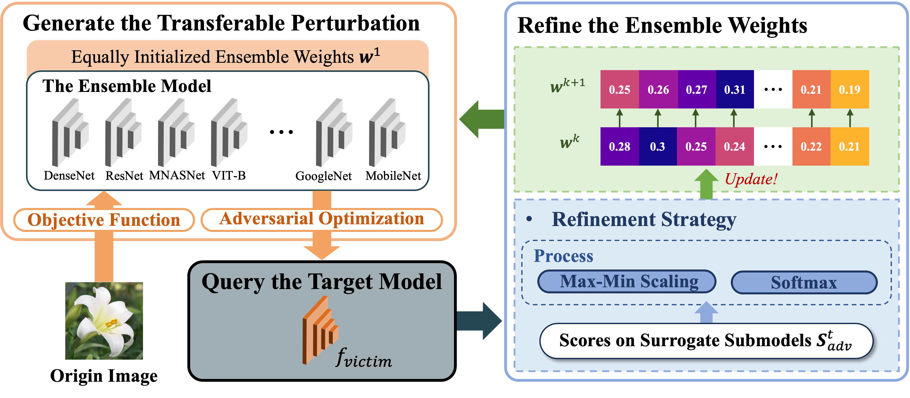

# QT-Attack: A Simple and Effective Query- & Transfer-Based Paradigm for Black-Box Hard-Label Attack

In this paper, we propose QT-Attack, a simple and effective paradigm that seamlessly combines query- & transfer-based pipelines for black-box hard-label attacks. It utilizes an ensemble model to generate transferable perturbations and employs a novel score-free refinement strategy to adjust the ensemble weights once the attack fails. Specifically, the refinement strategy can effectively enhance the transferability of generated perturbations by updating ensemble weights solely based on the ensemble model. Through a brief analysis, QT-Attack has a linear query complexity, and thus can achieve a higher attack success rate within the tight query budget.

<center> 

</center>


## Environment
See `requirements.txt`, some key dependencies are:

* python==3.8
* torch==1.11.0 

## Demo
### Dataset
We primarily perform experiments using [*NIPS-2017*](https://www.kaggle.com/datasets/google-brain/nips-2017-adversarial-learning-development-set) competition dataset. 

You should download the data before running our codes. 

### Attack against Torchvision models
Run the following code to perform QT-Attack against Torchvision models using the default configuration.

```bash
bash run.sh 
```

For running attacks against adversarially trained models, we use model weights that are released by the repository [*Fast adversarial training using FGSM*](https://github.com/locuslab/fast_adversarial?tab=readme-ov-file#fast-adversarial-training-using-fgsm). The randomly selected images are saved in `data/adversarial_training_images.txt`.


### Attack against Google Cloud Vision API
Use the following code to perform QT-Attack on Google Cloud Vision.
`data/gcv_images.txt` contains 100 images that are randomly selected from NIPS-2017 dataset.

```bash
python attack_gcv.py
```


